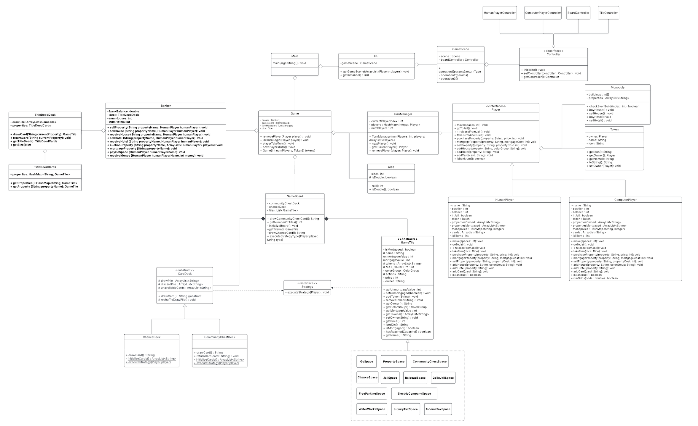

# Monopoly Game Project
### Developers
1. Jonathan Walsh
2. Sydney Shifman
3. Sean Creveling

### Project Description
The Monopoly Game Project is a JavaFX-based implementation of the classic board game Monopoly. The project aims 
to create a digital version of the game that allows users to play against the computer. 
The game includes features such as buying and selling properties, collecting rent, and drawing chance and 
community chest cards.

### Installing Code
To install the code, follow these steps:

1. Clone the repository from GitHub using: git clone https://github.com/your-username/monopoly-game-project.git
2. Navigate to the project directory using the command: cd MonopolyProject, or open the project in your IDE
3. Build the project using the command: mvn clean package
4. The project is now installed and ready to run.

### Steps to run through IDE
1. Go through the project directory (src/main/java/org/monopoly/View/Main.java) and run the Main class.
2. If project is not running, and gives SDK error, go to File > Project Structure > Project > SDK > then select an SDK 22 or higher.

### Project Purpose
The Monopoly Game Project is designed to provide a fun and interactive way to play the classic board game 
Monopoly. The game can be played by one user against the computer and has features like:

Buying and selling properties
Collecting rent
Drawing chance and community chest cards
Building houses and hotels

Note: This is a basic implementation of the game, and there may be some features that are not included. The project is intended to be a starting point for further development and customization.
As of right now, there is a User Interface implemented, but not completed.

### UML
